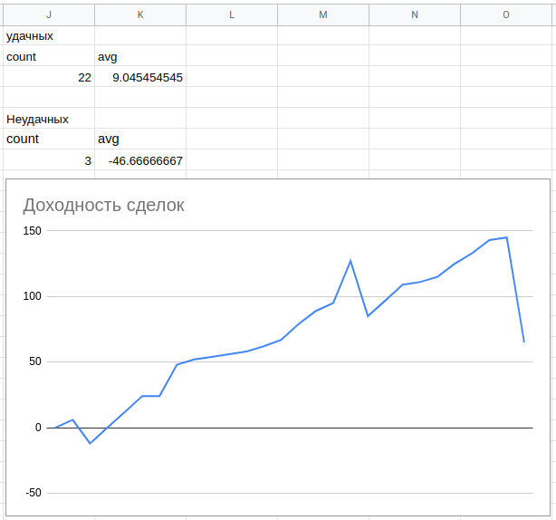

# Экспорт сделок из QUIK
Небольшой скрипт, который при запуске выгружает все сделки за текущий день в файл с датой в названии, вроде **2020-09-01.csv**. Предыдущие дни выгрузить невозможно, тк QUIK сохраняет через день только сделки по незакрытым позициям. Таблица выглядит следующим образом:

date       | time     | price | qty | class_code | sec_code
-----------|----------|-------|-----|------------|------
2020-09-23 | 19:07:43 | 21479 |  1  |   SPBFUT   | SRZ0
2020-09-24 | 11:50:16 | 21235 | -1  |   SPBFUT   | SRZ0
2020-09-24 | 11:50:34 | 21260 |  1  |   SPBFUT   | SRZ0
2020-09-24 | 11:50:53 | 21258 | -1  |   SPBFUT   | SRZ0
...        |  ...     | ...   | ... |    ...     | ....

Дальше сделки можно загрузить в google-таблицы для анализа торговли. Т.е. при импорте указать "Insert new sheet(s)", он создаст вкладку с датой в названии, и далее на отдельной вкладке проводить анализ, заменяя только название вкладки-донора на нужную дату. У меня это выглядит вот так:
